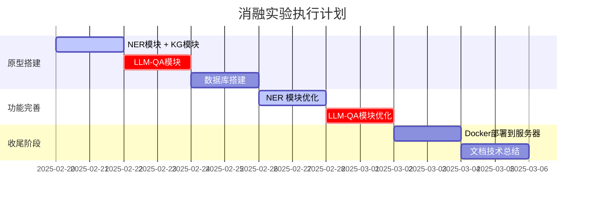
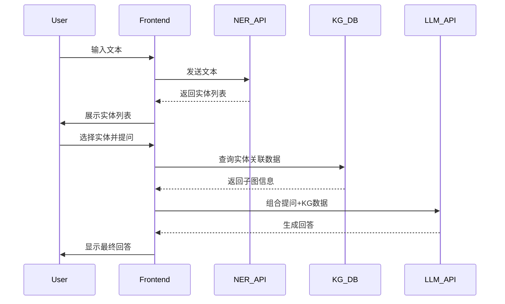

#
# 项目计划


# 交互设计

# TO DO      
- 下一步：联合测试neo4j的前后端页面及数据库，实现：
  - [x] 编写基础的前后端逻辑
  - [ ] docker启动neo4j、后端、前端
  - [x] 后端API接口连接上数据库
  - [x] 前端调用后端的API数据进行渲染并查看
  - [x] NER的标签错了，记得改
  - [ ] 大模型API引入
  - [ ] 三个模块之间建立关联
  - [ ] 界面功能美化


---
# Time Line
## 2025.2.21 下午
模块1、2的前后端雏形完成了，现在需要安排上docker，否则每次启动太墨迹。

## 2025.2.21 上午
- 搭建了基本的项目框架： 前端、后端、数据库
  - 单独测试了使用docker启动neo4j，并查看;
    - neo4j新版本登录选择 `bold + localhost:7687`
    - windows挂载文件时似乎有问题，应该用绝对路径，并且neo4j命令也是如此
    - ```bash
        LOAD CSV WITH HEADERS FROM 'file:///var/lib/neo4j/import/nodes.csv' AS row
        MERGE (:Node {id: row.id, name: row.name, type: row.type});
      ```
    - ```bash
        LOAD CSV WITH HEADERS FROM 'file:///var/lib/neo4j/import/relationships.csv' AS rel_row
        WITH rel_row
        MATCH (source:Node {id: rel_row.source})
        WITH source, rel_row
        MATCH (target:Node {id: rel_row.target})
        CALL apoc.create.relationship(source, rel_row.rel, {}, target) YIELD rel
        RETURN rel;
      ```  
